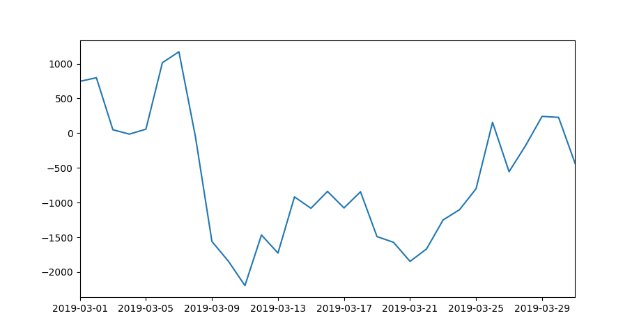
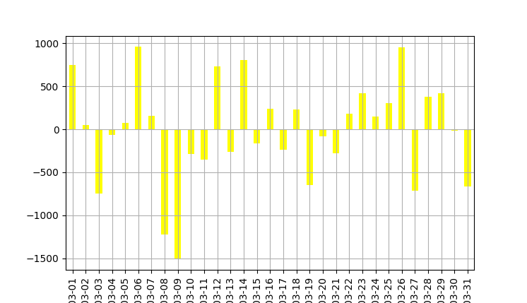
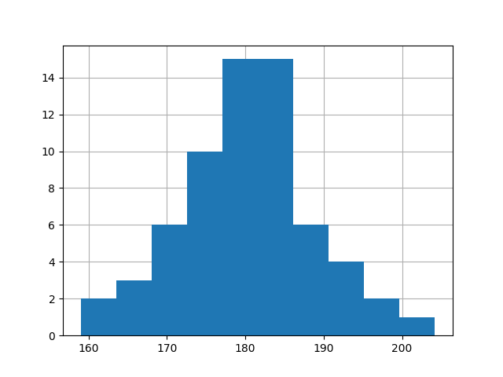
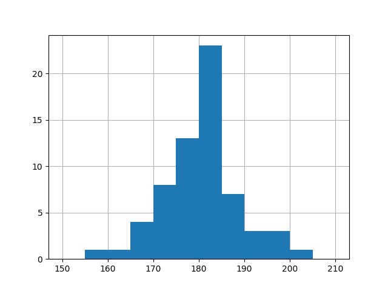

V této lekci si ukážeme, jak zobrazovat různé druhy grafů pomocí modulu `matplotlib`. Také si představíme Jupyter notebook, díky kterému budeme schopni vytvářet hezké reporty z našich datových analýz.

## První graf

Modul `matplotlib` nabízí ohromné množství možností pro vizualizaci dat. My zde probereme jen naprosté základy, aby nám lekce nenarostla to olbřímých rozměrů.

```pycon
>>> import matplotlib.pyplot as plt
```

Pokud vše proběhlo jak má, můžeme vyzkoušet zobrazit naše první data. Budou to pohyby na bankovním účtu za měsíc březen 2019.

```pycon
>>> pohyby = [746, 52, -749, -63, 71, 958, 157, -1223, -1509, -285, -350, 728, -260, 809, -164, 243, -238, 233, -646, -82, -275, 179, 417, 149, 301, 957, -711, 376, 421, -15, -663]
```

Z těchto dat si vyrobíme Pandas sérii. Abychom byli co nejpoctivější, vyrobíme si index naší série jako skutečné datumy,

```pycon
>>> import pandas
>>> import datetime as dt
>>> datumy = [dt.date(2019, 3, d) for d in range(1, 32)]
>>> ucet = pandas.Series(pohyby, index=datumy)
```

Nyní vyzkoušíme zobrazit přírůstky jako graf. Stačí napsat

```pycon
>>> ucet.plot()
>>> plt.show()
```


Užitečnější by mohlo být zobrazit například graf zůstatků

```pycon
>>> ucet.cumsum().plot()
>>> plt.show()
```



Nyní si s grafem můžeme vyhrát podle chuti a nastavit jeho vzezření přesně tak, jak potřebujeme. Metoda `plot` na sériích obsahuje nepřeberné možnosti nastavení. Například takto vyrobíme z pohybů na účtu sloupcový graf s mřížkou ve žluté barvě.

```pycon
>>> ucet.plot(kind='bar', color='yellow', grid=True)
>>> plt.show()
```



Protože možností a parametrů je opravdu hodně, vyplatí se číst [oficiální dokumentaci](https://pandas.pydata.org/pandas-docs/stable/reference/api/pandas.Series.plot.html) a projít si nějaký vhodný tutoriál na internetu například přímo [ten oficiální](https://pandas.pydata.org/pandas-docs/stable/user_guide/visualization.html) k vizualizaci v Pandasu.

## Typy grafů

Typ grafu, který chceme zobrazit, se v metodě `plot` specifikuje pomocí argumentu `type`. Sloupcový graf pohybů na účtu

Základní typy grafů, které se hojně používaji mohou být například tyto:


- `plot()` - [Bodový graf](https://matplotlib.org/api/_as_gen/matplotlib.pyplot.plot.html)
- `bar()` - [Sloupcový graf](https://matplotlib.org/api/_as_gen/matplotlib.pyplot.bar.html)
- `hist()` - [Histogram](https://matplotlib.org/api/_as_gen/matplotlib.pyplot.hist.html)
- `boxplot()` - [Krabicový graf](https://matplotlib.org/api/_as_gen/matplotlib.pyplot.boxplot.html)

## Histogramy

Histogram je důležitý typ grafu, který nám umožňuje zobrazit četnost hodnot z nějakého datasetu. Následující seznam obsahuje výšku 64 náhodných mužů v České republice, měřeno v centimetrech.

```pycon
>>> muzi = pandas.Series([
  179.3, 183.7, 181.4, 176.0, 183.6, 184.7, 163.4, 180.3,
  167.5, 166.8, 173.5, 172.5, 173.0, 177.6, 176.0, 179.5,
  182.6, 172.0, 183.2, 177.0, 176.2, 175.7, 174.3, 180.3,
  184.9, 171.1, 182.3, 169.7, 181.3, 188.8, 176.8, 159.0,
  180.3, 198.5, 185.8, 191.0, 170.9, 196.0, 183.3, 183.0,
  189.9, 184.8, 184.0, 183.1, 184.0, 190.7, 191.7, 187.8,
  177.5, 177.5, 189.2, 188.4, 195.0, 204.2, 180.2, 181.3,
  178.2, 182.6, 172.1, 175.7, 180.7, 181.2, 165.0, 188.6
])
```

Pomocí histogramu zobrazíme četnosti jednotlivých hodnot.

```pycon
>>> muzi.hist()
>>> plt.show()
```



Histogram si pro přehlednost můžeme rozdělit do <term cs="přihrádek" en="bins"> po pěti centimetrech

```pycon
>>> muzi.hist(bins=[
  150, 155, 160, 165, 170, 175, 180, 185, 190, 195, 200, 205, 210
])
>>> plt.show()
```



## Krabicový graf

Krabicový graf graficky znázorňuje medián a kvartily naměřených hodnot. Můžeme si jej vyzkoušet na výškách mužů.

```pycon
>>> muzi.plot(kind='box', whis=[0, 100])
>>> plt.show()
```


Krabicové grafy jsou užitečné předveším pro porovnání dvou různých měření. Přidejme si druhou datovou sadu představující naměřené výšky žen

```pycon
>>> zeny = pandas.Series([
  172.0, 169.0, 166.8, 164.6, 172.7, 171.5, 167.0, 167.0,
  168.3, 184.7, 166.0, 160.0, 168.8, 165.8, 173.5, 163.0,
  168.9, 158.4, 166.4, 169.4, 174.2, 175.6, 167.2, 168.0,
  171.5, 168.8, 168.9, 174.1, 169.0, 170.7, 156.3, 174.8,
  169.1, 161.4, 172.5, 166.1, 171.5, 163.9, 164.5, 169.0,
  168.5, 163.3, 169.5, 167.4, 175.5, 165.0, 166.6, 158.9,
  164.5, 168.7, 161.6, 175.8, 179.0, 167.9, 161.1, 167.6,
  165.9, 165.2, 176.0, 179.4, 160.1, 163.8, 177.7, 160.4
])
```

Nyní chceme zobrazit krabicový graf porovnávající výšky obou pohlaví. K tomu si z našich sérií vyrobíme DataFrame.

```pycon
>>> vysky = muzi.to_frame(name='muži')
>>> vysky['ženy'] = zeny
>>> vysky.plot(kind='box', whis=[0, 100])
>>> plt.show()
```


## Cvičení

### Házení kostkami


Mějme dvě hrací kostky, kterými vždy hodíme najednou a zaznamenáme součet bodů. Stáhněte si textový soubor [kostky.txt](excs/hazeni-kostkami/assets/kostky.txt), který obsahuje 1000 takových nezávislých hodů.

Načtěte tato data do Python seznamu, ze kterého vyrobte sérii. Zobrazte histogram hodů. Zvolte vhodné rozložení přihrádek a zodpovězte následující dotazy:

1. Jaká je nejčastější hodnota, která na dvou kostkách padne?
1. Je větší šance, že padne hodnota 12 než že padne hodnota 2?

### Call centrum

V souboru [callcentrum.txt](excs/call-centrum/assets/callcentrum.txt) najdete několik tisíc záznamů pro call centrum, které udávají časy mezi jednotlivými příchozími hovory v minutách a vteřinách. Načtěte tato data do série v Pythonu. Časy převeďte na vteřiny a zobrazte jejich histogram a boxplot. Co lze z těchto dvou grafů vyčíst?

### Hurá na hory

Následující data obsahují úhrnné množství sněhu (v cm) napadlé za každý rok pro posledních 50 let pro dva lyžarské resorty. První sloupec je rok, druhý jsou data pro resort Hora šílenství, třetí jsou data pro resort Prašné údolí.

```pycon
>>> snih = [
  [1968, 480, 351],
  [1969, 462, 663],
  [1970, 443, 490],
  [1971, 518, 444],
  [1972, 537, 420],
  [1973, 446, 941],
  [1974, 446, 691],
  [1975, 450, 477],
  [1976, 356, 395],
  [1977, 381, 652],
  [1978, 345, 525],
  [1979, 430, 762],
  [1980, 266, 316],
  [1981, 533, 781],
  [1982, 471, 769],
  [1983, 407, 801],
  [1984, 526, 633],
  [1985, 391, 488],
  [1986, 361, 624],
  [1987, 470, 471],
  [1988, 506, 514],
  [1989, 333, 208],
  [1990, 462, 909],
  [1991, 438, 443],
  [1992, 364, 488],
  [1993, 452, 579],
  [1994, 484, 519],
  [1995, 460, 809],
  [1996, 465, 682],
  [1997, 431, 814],
  [1998, 463, 595],
  [1999, 460, 512],
  [2000, 503, 750],
  [2001, 462, 951],
  [2002, 429, 413],
  [2003, 405, 738],
  [2004, 477, 777],
  [2005, 385, 316],
  [2006, 368, 417],
  [2007, 513, 635],
  [2008, 448, 689],
  [2009, 525, 443],
  [2010, 427, 225],
  [2011, 460, 618],
  [2012, 417, 742],
  [2013, 517, 247],
  [2014, 466, 552],
  [2015, 523, 441],
  [2016, 422, 690],
  [2017, 420, 699]
]
>>> snihdf = pandas.DataFrame(snih, columns=['rok', 'hora', 'udoli'])
>>> snihdf = snihdf.set_index('rok')
```

Použijte krabicový graf k porovnání sněhových srážek v obou resortech. Do kterého byste se vypravili příští rok na lyže a proč?


## Jupyter Notebook

Na úplný závěr našeho kurzu se naučíme pracovat s Jupyter notebookem. Je to webové prostředí, ve kterém můžete vytvářet hezky učesané reporty z vašich datových analýz. Jupyter musíme nejprve nainstalovat.

```shell
$ pip3 install jupyter
```

Pod windows jako obvykle stačí

```shell
$ py -m pip install jupyter
```

Nyní si někde na disku vytvoříme složku, ve které budeme skladovat naše Jupyter notebooky. V terminálu se přesuneme do této složky a napíšeme

```shell
jupyter notebook
```
